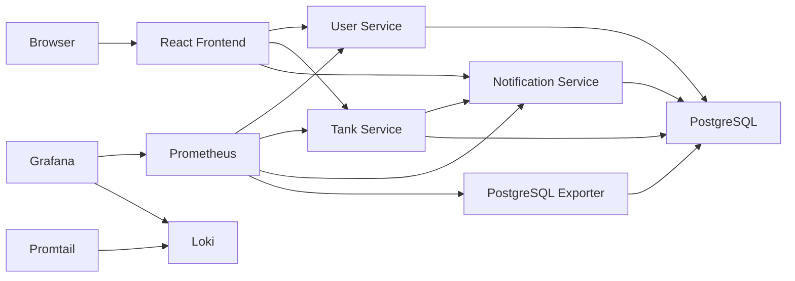
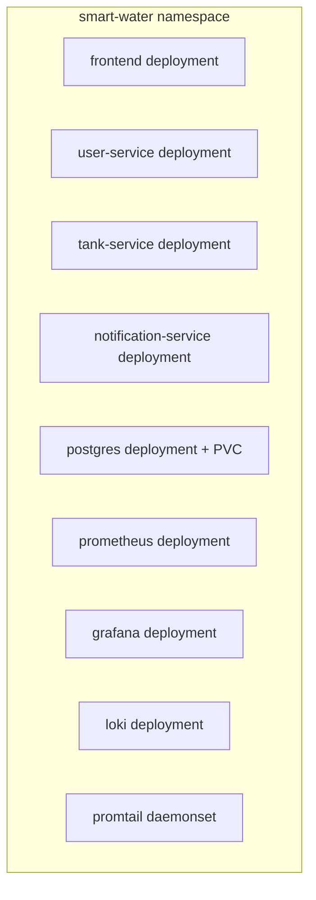
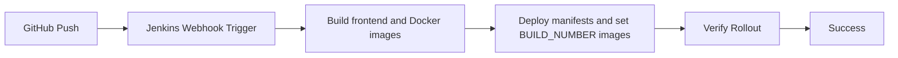

# Project Architecture

## Overview

Smart Water Monitoring Platform is a containerized microservices project for monitoring water tank levels, generating low-water alerts, and visualizing system health.

## Main Components

## Frontend

- Built with React and Vite.
- Shows dashboard metrics, tank levels, alerts, and system health.
- Communicates with backend APIs through Axios.

## Backend Services

### User Service

- Manages users.
- Exposes health and Prometheus metrics endpoints.
- Connects to PostgreSQL.

### Tank Service

- Creates tanks.
- Reads tank data.
- Updates water level.
- Calls Notification Service when water level changes.

### Notification Service

- Checks low-water conditions.
- Stores alerts in PostgreSQL.
- Keeps email/notification configuration optional and disabled for local demos.

## Database

PostgreSQL stores:

- `users`
- `tanks`
- `alerts`

On a fresh Kubernetes database, SQL scripts are mounted through `k8s/postgres-init-configmap.yaml` and executed automatically by the official PostgreSQL image.

Seed data:

- Main Tank: 75%
- Backup Tank: 40%

## Deployment Architecture

Docker Compose is used for local development. Kubernetes is used for orchestration and final deployment demonstration.

## CI/CD

The Jenkins pipeline is intentionally simple for a college viva and runs against local Docker Desktop Kubernetes.

## Observability

- Prometheus scrapes backend `/metrics` endpoints.
- Grafana provisions datasources and dashboards.
- Loki stores logs.
- Promtail ships logs to Loki.
- PostgreSQL Exporter exposes database metrics.
