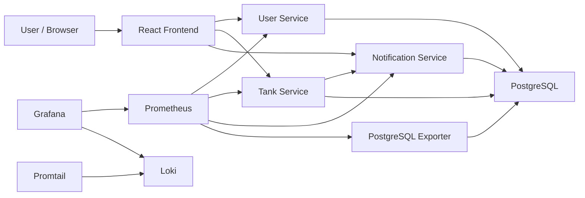

# Smart Water Monitoring Platform

Production-ready Smart Water Monitoring Platform built as a cloud-native portfolio project. It demonstrates microservices, React, PostgreSQL, Docker, Kubernetes, CI/CD, monitoring, alerting, and centralized logging.


## Features

- React dashboard for tank status, alerts, and system health.
- Node.js microservices:
  - User Service
  - Tank Service
  - Notification Service
- PostgreSQL persistence.
- Tank creation and water-level updates.
- Low-water alert generation.
- Optional notification configuration, disabled by default for local demos.
- Prometheus metrics from every backend service.
- Grafana dashboards for application, backend APIs, infrastructure, logs, and PostgreSQL.
- Loki and Promtail centralized logging.
- Docker Compose local deployment.
- Kubernetes production manifests with probes, resources, HPA, PVC, namespace, and Ingress.
- Jenkins CI/CD pipeline for local Docker Desktop image builds, Kubernetes deployment, and rollout verification.

## Tech Stack

| Layer | Technology |
| --- | --- |
| Frontend | React, Vite, Axios, React Router |
| Backend | Node.js, Express |
| Database | PostgreSQL |
| Containers | Docker, Docker Compose |
| Orchestration | Kubernetes |
| Monitoring | Prometheus, Grafana, PostgreSQL Exporter |
| Logging | Loki, Promtail |
| CI/CD | Jenkins |

## Architecture



More diagrams are available in [docs/architecture.md](docs/architecture.md).

## Docker

```powershell
copy .env.example .env
docker compose up --build
```

Open:

```text
Frontend:   http://localhost:5173
Prometheus: http://localhost:9090
Grafana:    http://localhost:3005
Loki:       http://localhost:3100
```

Grafana default login:

```text
admin/admin
```

## Kubernetes

```powershell
kubectl apply -f k8s/namespace.yaml
kubectl apply -f k8s/configmap.yaml
kubectl apply -f k8s/secret.yaml
kubectl apply -f k8s/postgres-pvc.yaml
kubectl apply -f k8s/
kubectl apply -f k8s/hpa/
kubectl apply -f k8s/monitoring/
kubectl apply -f k8s/logging/
```

Port forward:

```powershell
kubectl -n smart-water port-forward svc/frontend-service 5173:80
kubectl -n smart-water port-forward svc/prometheus-service 9090:9090
kubectl -n smart-water port-forward svc/grafana-service 3005:3005
```

## Monitoring

Prometheus scrapes:

- `user-service:3000/metrics`
- `tank-service:3001/metrics`
- `notification-service:3002/metrics`
- PostgreSQL exporter on `9187`

Dashboards:

- Smart Water Overview
- Backend APIs
- Infrastructure
- PostgreSQL Metrics
- Centralized Logging

## CI/CD

The [Jenkinsfile](Jenkinsfile) is designed for a realistic college-level Jenkins demo on Windows with Docker Desktop:

```text
GitHub Push
-> Jenkins Auto Trigger
-> Build Frontend
-> Validate Backend
-> Build Docker Images
-> Deploy Kubernetes
-> Verify Rollout
-> SUCCESS
```

Pipeline stages:

- Checkout Source
- Install Dependencies
- Build Frontend
- Validate Services
- Build Docker Images
- Deploy Kubernetes
- Verify Deployment

The pipeline builds local Docker images and deploys the Kubernetes manifests directly to the active Docker Desktop Kubernetes context. It does not require Docker Hub, Slack, cloud credentials, or paid services.

## Screenshots

Add project screenshots here after running the stack:

```text
docs/screenshots/dashboard.png
docs/screenshots/grafana-overview.png
docs/screenshots/prometheus-targets.png
docs/screenshots/kubernetes-pods.png
```

Recommended screenshots for GitHub:

- React Dashboard
- Tanks page after updating a water level
- Alerts page after a low-water event
- Prometheus targets page
- Grafana Smart Water Overview dashboard
- Grafana PostgreSQL Metrics dashboard
- Grafana Centralized Logging dashboard
- Kubernetes pods and services

## Resume Project Description

Built a cloud-native Smart Water Monitoring Platform using React, Node.js microservices, PostgreSQL, Docker, Kubernetes, Prometheus, Grafana, Loki, and Jenkins. Implemented real-time tank monitoring, low-water alerts, containerized deployments, Kubernetes production hardening, CI/CD automation, observability dashboards, centralized logging, and alert integrations.

## LinkedIn Project Description

I built a production-ready Smart Water Monitoring Platform as a cloud-native portfolio project. The system uses React, Node.js microservices, PostgreSQL, Docker, Kubernetes, Prometheus, Grafana, Loki, and Jenkins CI/CD. It includes tank monitoring, low-water alerts, Kubernetes scaling and probes, metrics dashboards, centralized logs, and automated deployment workflows.

## Documentation

- [Architecture](docs/architecture.md)
- [Local Setup](docs/local-setup.md)
- [Deployment Guide](docs/deployment-guide.md)
- [Kubernetes Setup](docs/kubernetes-setup.md)
- [Monitoring Guide](docs/monitoring-guide.md)
- [CI/CD Guide](docs/cicd-guide.md)
- [Jenkins Setup](JENKINS_SETUP.md)
- [CI/CD Flow](CI_CD_FLOW.md)
- [Jenkins Troubleshooting](TROUBLESHOOTING_JENKINS.md)
- [Troubleshooting](docs/troubleshooting.md)
- [Final Project Report](FINAL_PROJECT_REPORT.md)
- [Demo Script](DEMO_SCRIPT.md)
- [Interview Questions](INTERVIEW_QUESTIONS.md)
- [Resume Project Description](RESUME_PROJECT_DESCRIPTION.md)
- [Final Checklist](FINAL_CHECKLIST.md)
