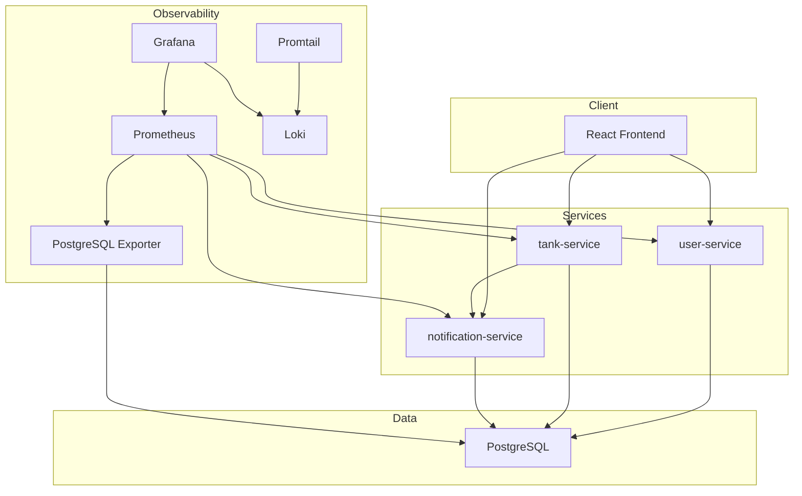
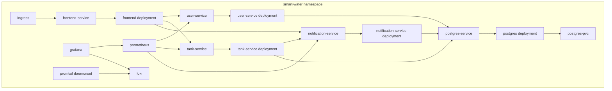
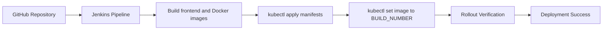
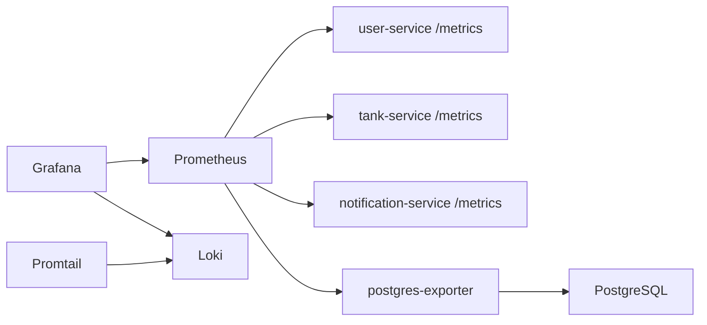
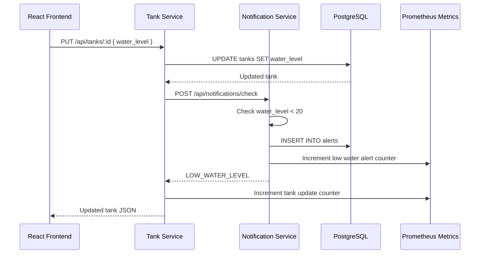
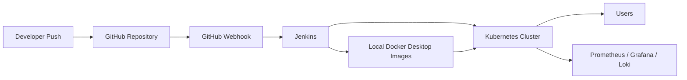

# Architecture

## System Architecture

```mermaid
flowchart TB
    subgraph Client
        Browser["React Frontend"]
    end

    subgraph Services
        User["user-service"]
        Tank["tank-service"]
        Notification["notification-service"]
    end

    subgraph Data
        Postgres["PostgreSQL"]
    end

    subgraph Observability
        Prometheus["Prometheus"]
        Grafana["Grafana"]
        Loki["Loki"]
        Promtail["Promtail"]
        PgExporter["PostgreSQL Exporter"]
    end

    Browser --> User
    Browser --> Tank
    Browser --> Notification
    Tank --> Notification

    User --> Postgres
    Tank --> Postgres
    Notification --> Postgres

    Prometheus --> User
    Prometheus --> Tank
    Prometheus --> Notification
    Prometheus --> PgExporter
    PgExporter --> Postgres
    Grafana --> Prometheus
    Promtail --> Loki
    Grafana --> Loki
```

## Kubernetes Architecture

```mermaid
flowchart TB
    subgraph Namespace["smart-water namespace"]
        Ingress["Ingress"]
        FrontendSvc["frontend-service"]
        UserSvc["user-service"]
        TankSvc["tank-service"]
        NotifySvc["notification-service"]
        PgSvc["postgres-service"]

        FrontendPod["frontend deployment"]
        UserPod["user-service deployment"]
        TankPod["tank-service deployment"]
        NotifyPod["notification-service deployment"]
        PgPod["postgres deployment"]
        PVC["postgres-pvc"]

        Prom["prometheus"]
        Graf["grafana"]
        Loki["loki"]
        Promtail["promtail daemonset"]
    end

    Ingress --> FrontendSvc --> FrontendPod
    FrontendPod --> UserSvc --> UserPod
    FrontendPod --> TankSvc --> TankPod
    FrontendPod --> NotifySvc --> NotifyPod
    TankPod --> NotifySvc
    UserPod --> PgSvc --> PgPod
    TankPod --> PgSvc
    NotifyPod --> PgSvc
    PgPod --> PVC
    Prom --> UserSvc
    Prom --> TankSvc
    Prom --> NotifySvc
    Graf --> Prom
    Promtail --> Loki
    Graf --> Loki
```

## CI/CD Pipeline

```mermaid
flowchart LR
    Git["GitHub Repository"] --> Jenkins["Jenkins Pipeline"]
    Jenkins --> Build["Build frontend and Docker images"]
    Build --> Deploy["kubectl apply manifests"]
    Deploy --> Images["kubectl set image to BUILD_NUMBER"]
    Images --> Verify["Rollout Verification"]
    Verify --> Success["Deployment Success"]
```

## Monitoring Architecture

```mermaid
flowchart LR
    Prometheus["Prometheus"] --> User["user-service /metrics"]
    Prometheus --> Tank["tank-service /metrics"]
    Prometheus --> Notify["notification-service /metrics"]
    Prometheus --> PgExporter["postgres-exporter"]
    PgExporter --> Postgres["PostgreSQL"]
    Grafana["Grafana"] --> Prometheus
    Promtail["Promtail"] --> Loki["Loki"]
    Grafana --> Loki
```

## Low Water Alert Sequence

```mermaid
sequenceDiagram
    participant UI as React Frontend
    participant Tank as Tank Service
    participant Notify as Notification Service
    participant DB as PostgreSQL
    participant Metrics as Prometheus Metrics

    UI->>Tank: PUT /api/tanks/:id { water_level }
    Tank->>DB: UPDATE tanks SET water_level
    DB-->>Tank: Updated tank
    Tank->>Notify: POST /api/notifications/check
    Notify->>Notify: Check water_level < 20
    Notify->>DB: INSERT INTO alerts
    Notify->>Metrics: Increment low water alert counter
    Notify-->>Tank: LOW_WATER_LEVEL
    Tank->>Metrics: Increment tank update counter
    Tank-->>UI: Updated tank JSON
```

## Deployment Diagram

```mermaid
flowchart LR
    Dev["Developer Push"] --> GitHub["GitHub Repository"]
    GitHub --> Webhook["GitHub Webhook"]
    Webhook --> Jenkins["Jenkins"]
    Jenkins --> Images["Local Docker Desktop Images"]
    Jenkins --> K8s["Kubernetes Cluster"]
    Images --> K8s
    K8s --> Users["Users"]
    K8s --> Observability["Prometheus / Grafana / Loki"]
```
